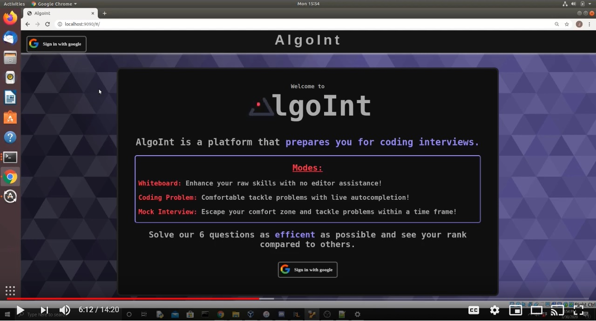

# AlgoInt

**AlgoInt is a web application made for practicing coding interviews.**

## Group members:
- Jeremy Storring (JNS855)
- Justice SK (JJS497)
- Ricardo Rheeder (RIR954)
- Sarah Piot (SFP987)

### Check out the YouTube video below:

<!-- 

<iframe width="560" height="315" src="https://www.youtube.com/embed/3Bdj9buMjm8" frameborder="0" allow="accelerometer; autoplay; encrypted-media; gyroscope; picture-in-picture" allowfullscreen></iframe>

 -->

# Docker Functions

In order for the dockerfile to run, you need to do this (need docker to work and in the folder in which Docker is created)

docker system prune -a  
docker build -t python-test .  
docker run -v /home/justicesk/Documents/Test/tmp:/tmp -it --rm -e path_file=One.py python-test

Note that the path /home/justicesk/Documents/Test/tmp is the path where you want to write into it.

### React-Ace: https://www.npmjs.com/package/react-ace
